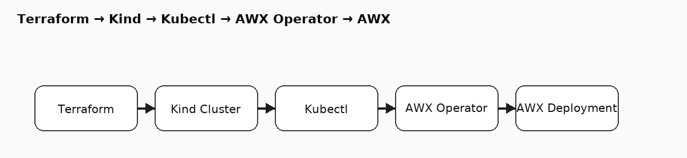

# 🚀 AWX Deployment on Kind using Terraform + Kubectl (WSL2)

This guide documents the full process of deploying **AWX** using **Terraform** and **Kind**, combining real terminal output and fixes.  
It now includes visual diagrams to make the workflow and architecture crystal clear.

## 📊 Visuals

### 1) Terraform Workflow


### 2) AWX Architecture


### 3) Troubleshooting Flow


---

## 📦 Step 1: Install Terraform

```bash
sudo apt-get update && sudo apt-get install -y gnupg software-properties-common curl
curl -fsSL https://apt.releases.hashicorp.com/gpg | sudo gpg --dearmor -o /usr/share/keyrings/hashicorp-archive-keyring.gpg
echo "deb [signed-by=/usr/share/keyrings/hashicorp-archive-keyring.gpg] https://apt.releases.hashicorp.com $(lsb_release -cs) main"   | sudo tee /etc/apt/sources.list.d/hashicorp.list
sudo apt-get update
sudo apt-get install terraform -y
terraform version
```

**Expected Output:**
```
Terraform v1.13.1
on linux_amd64
```

---

## ⚙️ Step 2: Initialize Terraform

```bash
terraform init
```
**Expected Output:**
```
Terraform has been successfully initialized!
```

---

## 🚀 Step 3: Apply Terraform

```bash
terraform apply -auto-approve
```

### ⚠️ Caution — Unsupported Argument
```
Error: Unsupported argument
  on main.tf line 26, in provider "kubectl":
  26:   server_side_applied    = true
```
**Fix:** Remove these from the `kubectl` provider:
- `server_side_applied`
- `force_conflicts`
- `validate_schema`

---

## 🌐 Step 4: Install kubectl (Fix repo error)

**Problem:**
```
E: The repository 'https://apt.kubernetes.io kubernetes-xenial Release' does not have a Release file.
```
**Fix (new repo):**
```bash
sudo rm -f /etc/apt/sources.list.d/kubernetes.list
sudo mkdir -p /etc/apt/keyrings
curl -fsSL https://pkgs.k8s.io/core:/stable:/v1.30/deb/Release.key  | sudo gpg --dearmor -o /etc/apt/keyrings/kubernetes-apt-keyring.gpg
echo 'deb [signed-by=/etc/apt/keyrings/kubernetes-apt-keyring.gpg] https://pkgs.k8s.io/core:/stable:/v1.30/deb/ /'  | sudo tee /etc/apt/sources.list.d/kubernetes.list >/dev/null
sudo apt-get update
sudo apt-get install -y kubectl
which kubectl && kubectl version --client
```
**Expected Output:**
```
/usr/bin/kubectl
Client Version: v1.30.14
```

---

## 🟢 Step 5: Successful Apply + Operator Install

Terraform creates the Kind cluster, namespace, installs the AWX operator, and applies the AWX CR.

**Key lines to expect:**
```
kind_cluster.this: Creation complete
deployment.apps/awx-operator-controller-manager created
kubectl_manifest.awx_cr: Creation complete
```

If you see:
```
Error: Post "https://127.0.0.1:....": dial tcp ... connection refused
```
**Fix:** Ensure the Kind context is selected and API is ready. Add a wait loop (as in the Terraform `wait_api` step) or re-run once `kubectl get nodes` returns ready nodes.

---

## 🔑 Step 6: Retrieve Admin Password

**Common pitfall:**
```
base64: invalid input
```
**Fix:** Use single quotes in jsonpath:
```bash
kubectl -n awx get secret awx-demo-admin-password -o jsonpath='{.data.password}' | base64 -d; echo
```
**Sample Output:**
```
aeaU7ZYzjtubGxFQ22olUF8818xj9qeq
```

---

## 🌍 Step 7: Access AWX Web UI

```bash
kubectl -n awx port-forward svc/awx-demo-service 8043:80
```
Open: **http://localhost:8043**  
Login: **admin** / (password from above)

---

## 🔎 Useful Checks

```bash
kubectl -n awx get pods
kubectl -n awx get awx
kubectl -n awx get secret | grep -i admin
```

---

## ✅ Summary

- Terraform + Kind + kubectl + AWX Operator were used to deploy AWX locally.
- Real-world errors were captured and fixed (unsupported args, repo 404, kubectl missing, base64 quoting).
- Diagrams illustrate the workflow, architecture, and troubleshooting process.
